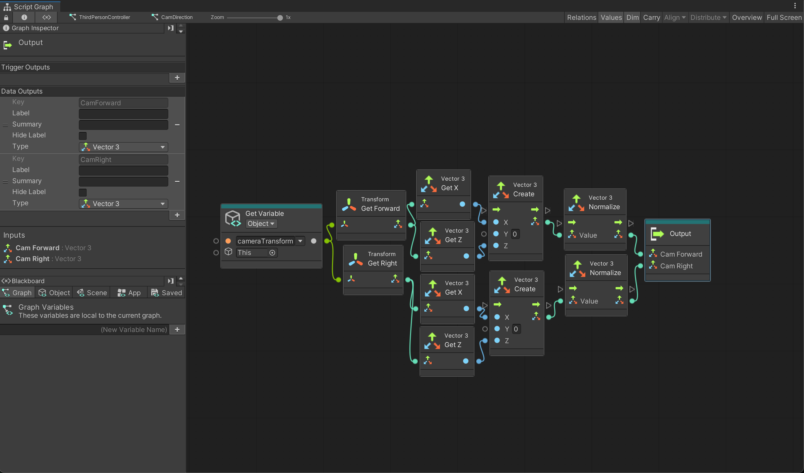
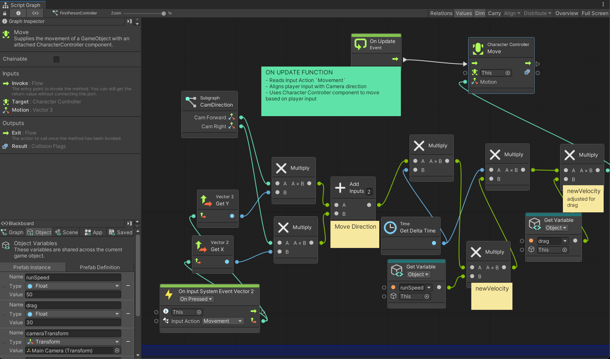

# Adventure Game Boiler Plate Part 1
***


Loose notes on Character Controls, such as: 

- 1st Person Camera ❌
- 3rd Person Camera ✅
- Basic Movement ✅
- Mechanim Animation System 
- Walking
- Strafing
- Sprinting
- Jumping
- Falling
- Blend Trees
- New Input System
- Turning in place
- Slope Handling
- Edge Detection
- Step Handling
- Wall Handling
- Camera Zoom Controls
- Camera Collision Detection
- Cinemachine
- Player Actions
- Avatar Masks
- Animation Blending
- Multiplayer

## Overview

This is a text guide based on the following video: 

[Complete Course April 16, 2024](https://youtu.be/muAzcpAg3lg?si=w-RTZ9dHgLlFepmJ)

Using the following assets for free: 

[FREE Low Poly Human - RPG Character](https://assetstore.unity.com/packages/3d/characters/humanoids/fantasy/free-low-poly-human-rpg-character-219979)

With a backup of all files for the course here: 

[Github Link](https://github.com/spaderdabomb/FinalCharacterController/tree/part1)

***BIG NOTE*** 

There are major changes to the video guide, such as: 

- Using Unity Version 6 and versions of packages updated up to April 2025
- No First Person, only 3rd person
- No C# scripting, only Visual Scripting (Script Machine component, Script Graph files)
- Free movement instead of Strafe movement (less animations, less work, smoother more natural feel for most non-aiming games)
- MORE TO COME

## Getting Started

### 1. Create a new Project

Create a 3D URP (NOT HDRP or the built-in render pipeline. It might say 3D SRP in Unity version 6)

### 2. Packages

We need some packages to start, and every time you install one it will show up in the Packages folder next to the Assets folder. Go to `Window > Package Manager`, set the Packages listed to Unity Registry, and install the following: 

- Input System (requires restarting the editor)
- - Commonly referred to as the "New" input system which can handle keyboard and controller inputs at the same time

- [FREE Low Poly Human - RPG Character](https://assetstore.unity.com/packages/3d/characters/humanoids/fantasy/free-low-poly-human-rpg-character-219979)
- - From the website, make sure to click the "Open in Unity" button which will open up the package manager in Unity
- - Make sure to Import it. It will show up in your Assets folder

- ProBuilder
- - Go to the Samples tab and Import the Universal Render Pipeline Support and the Editor Examples

- [Packages] Cinemachine v 3.1.3 (requires restarting the editor)

## Character Controls

### 1. Project Setup

Let's start by dragging in the character we just imported. It can be found at 

`Assets > Blink > Art > Characters > LowPoly > FREE_HumanLowPoly > Prefabs_Humans`

When dragged into the hierarchy, it will show up Pink and in a T-Pose. To fix the pink material, go to `Window > Rendering > Render Pipeline Converter`, check the `Material Upgrade` box and click `Initialize And Convert`

In this case, we are going to make our own Prefab out of this so do the following: 

1. `Right Click HumanMale > Prefab > Unpack Completely` and then rename it `CharacterController`
2. `Right Click Hierarchy > Create Empty > name it 3rdPersonPOV` 
3. Drag the `Main Camera` into `3rdPersonPOV`, it should look like this: 

```
>3rdPersonPOV
->CharacterController
->MainCamera
```

This is because we want a 1st person view, we need the camera and character together as 1 object, but not be dependent on each other.

In your Assets folder, create a new folder and name it `CustomAssets` and another folder within that called `FinalCharacterController`. Within THAT folder, create a new folder called `Prefabs` and drag the `3rdPersonPOV` from the hierarchy into the folder.

By doing this, you've turned this new game object into a Prefab, meaning any changes made to it can be permanently saved, and used to create copies, much like a prototype. When selecting the `3rdPersonPOV` object in the hierarchy, you'll also see in the Inspector a dropdown item that says `"Overrides"`. When you make changes, you should select it and click the `"Apply All"` button to save the changes to the object in this `Prefabs` folder.

Also, make sure to change the Tag of `3rdPersonPOV` to `Player`

Side note, his underwear currently matches his skin tone so if you want to change that, go to the `Hierarchy > 3rdPersonPOV > CharacterController > Mesh > Accessories > Underwear`. Select it, and then go to the `Inspector > Underwear (Material) > Surface Inputs > Base Map` and change the color to whatever you like!

### 2. ProBuilder Setup

Probuilder will help us easily create shapes. To use it, go to `Tools > ProBuilder > Editors > Create Shape > Plane`, click and drag a square shape around the character. This will create a floor.

**OPTIONAL** The floor will be very bright, so you can click on Sprite and in the Inspector, go to `Mesh Renderer > Materials (expand it) > Click the name ProBuilder Default URP`. This will bring up it's location in the Project folders below. Select it.

Once it's properties show up in the Inspector, go to `Surface Inputs > Albedo (click Select)` and select the green GridBox texture. This should make things easier to see.

### 3. New Input System

**Note**: When you create a Player Input component on a game object, it defaults to a set of input actions that are project-wide. These are already receiving inputs from the keyboard/gamepad, and the default actions can be utilized in scripting. However, this guide will create a custom one, giving you more control and an understanding of the Input System

Create a new folder under `FinalCharacterController` called `Inputs`. Inside that folder, `Right Click > Create > Input Actions` (all the way at the bottom) and call it `PlayerInputs`. Double click it to open it up.

Here we have a few different menus. On the left side we have Action Maps (a set of actions). Click the `+` and create a new one. The first set of actions have to do with Player Movement (formally known as Player Locomotion). Call it `PlayerLocomotionMap`.

In the next menu, we have our specific Actions. These are Actions like Jump, Movement, Sprint, etc. We will name this Action `Movement`.

On the right side you have Action Properties. Change the Action Type to `Value` and Control Type to `Vector 2`. This is because we only want the movement to affect X and Z values (Forward/Back, and Left/Right).

Now theres a convenient feature built in here that allows for movement input, so if you look at the Actions and click the `+` icon next to movement and select `Add Up/Down/Left/Right Composite`. Rename the `2D Vector` as `WASD`. You can assign each direction a Binding by selecting it, and in the Binding Properties change the Path to `W [Keyboard]` for Up, and the rest to their appropriate button.

You can also bind inputs by pressing the `Listen` button, and pressing the button on your keyboard/gamepad and it should show up on the top!

Now what's great about assigning controls this way is that for the same Action of Movement, you can add another binding of the same type, but call it `Left Stick` and assign the directions to the Gamepad. Do this by clicking `Path > Gamepad > Left Stick/Up [Gamepad]`. Because this is a joystick, we want the values to be analog so click `Left Stick > Binding Properties > set Mode to Analog`. Now click `Save Asset` in the top right of this window and close it. Congrats! We have movement 😄

Now to apply these inputs to our character, select the `CharacterController` from the hierarchy and in the Inspector on the right side, `Add Component > Player Input > drag in PlayerControls.inputaction`

***NOTE: FOR THE REST OF THIS README, ALL C# CODE WILL BE CONVERTED TO VISUAL SCRIPTING.***

Within the FinalCharacterController folder, create a folder named `Scripts`. Inside this folder, `Right Click > Create > Visual Scripting > Script Graph` and name it `PlayerController`. To add it to our Prefab, select the `CharacterController` in the Hierarchy and select `Add Component > Script Machine`. The first time you do this, it will add a Variables component as well. Drag the `PlayerController` Script Graph into the Graph slot.

NOTE: If you want to update your Prefab via the Hierarchy (change the prototype to the version currently in the scene), now is a good time to practice it! In the Inspector click on the Overrides button and select `Apply All` to apply any changes that you've made in the Hierarchy

### 4. Character Controller vs Rigidbody

To connect the player's inputs to actually moving the character, the character will need a component that is in charge of the movement. In Unity, you can either use something called a `Character Controller` or a `Rigidbody Controller`.

What type of player controller are we gonna make? 

|      	| Rigidbody Controller                             	| Character Controller                                 	|
|------	|--------------------------------------------------	|------------------------------------------------------	|
| PROS 	| Good with realistic physics interactions         	| High degree of precision and control                 	|
|      	| Simpler initial setup                            	| Less unexpected environmental interactions           	|
|      	| Good with complex and dynamic scene interactions 	| Built-in slope handling                              	|
|      	|                                                  	|                                                      	|
| CONS 	| Lack of precision and control                    	| Harder to set up                                     	|
|      	| Harder slope handling                            	| Not good for realistic interactions with environment 	|
|      	| Slightly worse performance                       	|                                                      	|

Since Character Controller is more universal and easier to perfect, we will be using that.

On the `CharacterController` 

	AND on the `Main Camera` 

(we will use both to move the camera with the character), click `Add component > Character Controller`. Things like Slope Limit and Step Offset will be changed later when it's important. You will see in the Scene window that the capsule shaped Collider is surrounding the feet and is too low, so change the following settings: 

- **Min Move Distance**: 1e-05
- **Center**: X (0) Y (0.9) Z (0)
- **Radius**: 0.3
- **Height**: 1.8


### 5. Input System Script Graph

#### 5A. Add Variables to the character

Next, we are going to need some variables to easily manage the character's speed when playtesting it. It will be done by adding them in the Variables component of our `CharacterController`, making them Object Variables. The benefit is that we can easily access and modify these variables during a play test. The only downside is that if you open the `PlayerController.asset` file on it's own, you will not see these variables. This is because you would be seeing the script graph outside of the context of our `CharacterController`, so make sure to go into the Inspector and click "Edit Graph" if you want to see the Object Variables.

Add the following: 

1. **runSpeed** - Holds the current movement velocity each frame.
- Type: `Float`
- Value: `50`

3. **drag** - Changes in velocity to reduce sliding (simulating friction).
- Type: `Float`
- Value: `30`

5. **cameraTransform**
- Type: `Transform`
- Value: `GameObject Main Camera` drag it from under `CharacterController`

#### 5B. Add Nodes to PlayerController.asset

`Assets/CustomAssets/FinalCharacterController/Scripts Right Click > Create > Visual Scripting > Script Graph > name it PlayerController`

`CharacterController > component Script Machine > drag PlayerController into the Graph slot`. If you want to use the Object Variables in the graph, make sure to select `Edit Graph` from here instead of opening the file on its own.

You might get a warning that says: 

```
Your Unity preferences are set to reload scripts during play mode.
This causes instability in Visual Scripting plugins.
Please use: Preferences > General > Script Changes While Playing > Stop Playing and Recompile.
Would you like to change it now?
[Change now] [I will change later]
```

Change it now, and add the following nodes: 

- 
- 


### 6. Third Person Camera


#### 6A. Cinemachine Camera

- Duplicate the Main Camera
- Untag the original Main Camera
- Put the NEW Main Camera inside the original
- Rename the Parent camera to `CameraShoulder`
- Rename the Child camera to `Main Camera`
- on the `CharacterController`, replace the `cameraTransform` value with the new `Main Camera`
- Select the `CameraShoulder > Inspector > Disable Camera Component && Audio Listener Component`
- Right Click `CameraShoulder > Cinemachine > Cinemachine Camera`
- - The new `Main Camera` should be identified as the Cinemachine's Virtual Camera (see the blue icon next to it)
- Select the `Cinemachine > Inspector > drag the CharacterController to the Follow and Look At attributes`
- - set `Standby Update` to `Always`
- - set `Position Control` to `Orbital Follow`
- - - The new component should prompt you to "Add Input Controller", click that button
- - set `Rotation Control` to `Rotation Composer`

That's it! Cinemachine's Input Axis Controller should give some nice mouse (or gamepad right stick) camera controls, and your character should be moving forward/back/left/right in reference to the camera direction.

**OPTIONAL**

set `Vertical Lens FOV` up or down to your comfort level

### 7. Save

Make sure to save the Prefab for `3rdPersonPOV`. 

- `Inspector > Overrides > Apply All` Saves it, packaging it up in `CustomAssets/FinalCharacterController/Prefabs`

